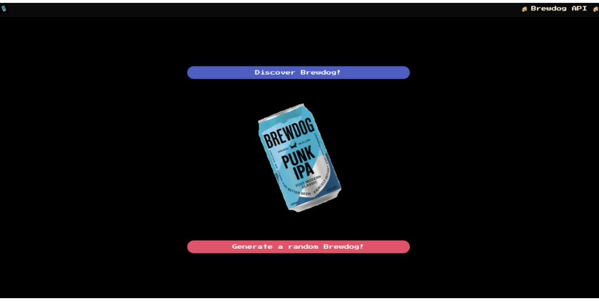
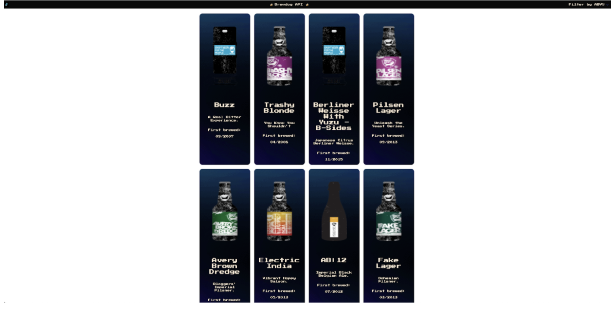
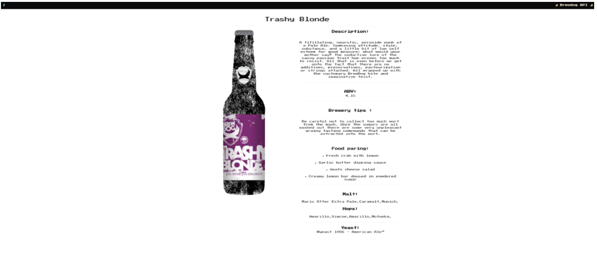

# General Assembly  Project Two, BreweryApp, Pair-coding

## Project Overview

BreweryApp is a beer searching app using BrewDog API. BreweryApp will help you to find your favourite BrewDog beer. This was a 2-day hackathon project that was pair coded and my first experience of using a public API and building the front-end in React.

## Time to build   
#### 52 hours

### Visit BreweryApp **[here](https://brewerybrewdogapi.netlify.app/)**!

## Code Installation
- Clone or download the repo
- Install Yarn in terminal to install all packages needed with the command: `yarn`
- Start server with the terminal command: `yarn start`

## Project Brief
- Consume a public API – this could be anything but it must make sense for your project
- The app can have a router - with several "pages", this is up to your decision and if it makes sense for your project
- Include wireframes - that you designed before building the app
- Be deployed online and accessible to the public

## Technologies Used
### Front-end:
- React
- JSX
- Axios
- Bulma
- Google Fonts
- React Router Dom

### API Used:
- **[BrewDog API](https://api.punkapi.com/v2/beers)**

### Dev tools:
- VS code
- Yarn
- Insomnia
- Git
- Github
- Google Chrome dev tools
- Netlify (deployment)

## Approach taken
### Planning and Preparation
Because this project's deadline was less than 3 days after being given the brief - I and Lukacs had to quickly get a plan together. We spent the first evening searching for an appropriate API to use. With the idea that we wanted to do an app based on product selection, we used Insomnia to test the responses to make sure we were getting what we needed. We settled on BrewDog API.

### This API allowed us to
- **GET** a random beer from the full database
- **GET** a selected beer based on its ID
- **GET** all beers in the database. 
 
Now that we were happy with the design and API, we were able to start building the front-end. This was built using React. We decided to pair code the project using VS Code's Live Share functionality. This initially enabled us to work on building out the JSX frame for each page together and then eventually delegating the work between us for different sections.

#### GET random beer:
For the API requests, we set up and used Axios to get the data. Initially, I started by using console.logs to check in the chrome dev tools that we were able to get the right responses on the front end and then moved on to using that data to show the images and title for the random beer page.
#### GET beer by ID:
We had to make the next API call when the user click on the beer card to get particular beer details by its individual ID. 
#### GET all beers:
When we get the response from BrewDog API we have to use the map function to interact with JSON and get all needed information. 
#### Styling method:
Throughout the build process, we used the Bulma CSS framework for its ease and efficiency. This allowed us whilst building out the project to keep styling in mind when creating the JSX in React - Adding the necessary classes to each tag to help speed up the styling process at the end.
#### MVP & NTH's:
We have decided that for MVP we want to just display all the beers and get beer by ID. By achieving those fairly quick we decided to implement Nice To Have functionality and we added a random beer and filter option on the main page.
#### Navbar and filter:
Because we want to add filtering just on the main page we have to create two versions of the navbar and render them where needed.

## Wins and  Blockers
### Wins:
- Overall I am very happy with the styling of the product.
- Very happy that we were able to add in the filtering function as this is a very useful feature and takes the app to the next level.
- It was my first experience of pair coding on a project and I feel I learnt a lot about working this way. Using driver/typing methods as well as delegating work between us. Then working through issues together and sudo coding through problems. A very good learning experience.
### Blockers:
- One of the blockers was that the nested information about used malt, hops and yeast. To use it we have to save them in different states and map thru them again to display them on the page.
- Another thing was filtering, after researching thru different sources like react documentation and StackOverflow we decided to get help from our teaching team. 

## Bugs
- Error handling message is displayed at the bottom of the page at all times, even the API is fully loaded.
 
## Future Content and Improvements
- Users being able to log in and add the beers to their favourites
- Adding another API with recipes to match meals for each beer
- Fix all the bugs.

## Key Learnings
This was my first project working in a pair and I feel that I definitely learnt a lot from this experience. It felt very positive having someone else working towards the same goal and solving problems together. I also felt that the process of pair coding really meant that I had to think more about the way I am doing things, in terms of sudo-coding through problems and getting them down in code. It really helped me take a step back from just throwing things into the code and into having to work things out in a step by step manner beforehand.
 
## Deployment
The app was deployed on the Netlify platform. 

## Quick App overview

